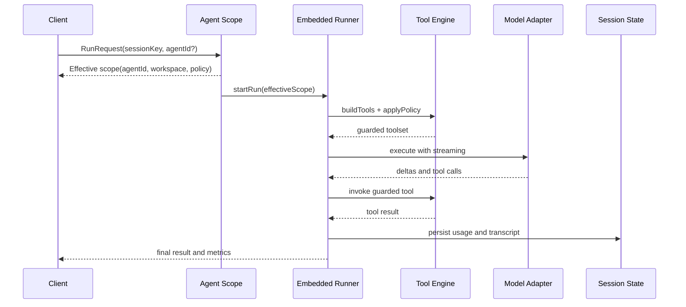

# Agents system design

Last updated: 2026-03-09

## Overview

This document explains how `src/agents/` is structured and how to design a similar system from scratch.

If you want to build an OpenClaw-like agent runtime, treat the agents subsystem as five cooperating layers:

1. **Scope and identity layer**: agent IDs, session key parsing, workspace inheritance.
2. **Execution layer**: embedded runner, run lifecycle, streaming and cancellation.
3. **Tool layer**: tool registry, policy pipeline, schema normalization, sandbox file safety.
4. **Model and auth layer**: provider catalog, model config resolution, auth profile selection.
5. **State and reliability layer**: locks, persistence repair, retries, timeouts, and tracing.

## Design goals

A robust coding-agent runtime should satisfy these goals:

- **Session continuity**: keep a stable mapping between user conversation and agent context.
- **Deterministic safety**: enforce path limits, tool policy, and execution constraints before tool calls.
- **Provider portability**: support multiple model providers with compatibility transforms.
- **Subagent orchestration**: allow nested tasks while preserving accountability and cleanup.
- **Operational resilience**: survive retries, restarts, partial failures, and stale state on disk.

## Code map of src/agents

Use this map as your first navigation pass:

- **Agent scope and workspace**
  - `src/agents/agent-scope.ts`: default agent resolution, per-agent config merge, session agent selection.
  - `src/agents/workspace.ts`: workspace defaults, bootstrap seed files, onboarding state.
  - `src/agents/spawned-context.ts`: spawned run metadata and workspace inheritance.
- **Execution runtime**
  - `src/agents/pi-embedded-runner.ts`: exports embedded run APIs and lifecycle utilities.
  - `src/agents/pi-embedded-runner/*`: run path, history limits, lane routing, system prompt override, tool split.
- **Tools and policy**
  - `src/agents/pi-tools.ts`: assembles coding tools, channel tools, OpenClaw tools, wrappers, and provider-specific filtering.
  - `src/agents/tool-policy.ts` and `src/agents/tool-policy-pipeline.ts`: allowlist, owner-only rules, group policy composition.
  - `src/agents/tool-catalog.ts`: normalized tool metadata and presentation.
- **Models and auth**
  - `src/agents/models-config.ts`: provider/model configuration persistence and normalization.
  - `src/agents/model-catalog.ts`: model catalog mapping and provider-facing model descriptors.
  - `src/agents/auth-profiles/*`: credential strategy, profile ordering, cooldown and health heuristics.
- **Subagent runtime and reliability**
  - `src/agents/subagent-registry.ts`: subagent run tracking, announce retry/backoff, orphan reconciliation.
  - `src/agents/session-write-lock.ts`, `src/agents/session-file-repair.ts`: consistency and repair of session artifacts.
  - `src/agents/timeout.ts`, `src/agents/trace-base.ts`, `src/agents/usage.ts`: timeout policy, tracing, usage accounting.

## Runtime architecture

### 1) Scope resolution

Before each run, resolve:

- effective `agentId` (explicit > session key > default)
- effective workspace directory
- effective model/tool policy from global + per-agent config

This is centralized around `agent-scope.ts` and `spawned-context.ts` so downstream code does not re-implement identity logic.

### 2) Embedded run lifecycle

The embedded runner exposes run APIs for:

- enqueue run
- stream intermediate events
- abort active run
- wait for completion

This keeps transport layers (CLI, gateway, channels) decoupled from model SDK specifics.

### 3) Tool construction and guard pipeline

Tool assembly is intentionally multi-stage:

1. Build base tools (read, edit, exec, process, channel-specific, OpenClaw-specific).
2. Normalize and patch schemas for provider compatibility.
3. Apply policy pipeline (owner rules, allowlists, group/subagent constraints).
4. Wrap execution hooks (before call, abort signal, workspace root guards).

This makes safety composable and testable.

### 4) Provider and model adaptation

Different model providers have incompatible expectations for tool schemas and behavior.

OpenClaw handles this with provider-aware adapters, such as:

- schema cleanup for provider quirks
- tool suppression when provider has native tool name conflicts
- auth profile selection and fallback logic

### 5) Subagent orchestration

Subagent flows are tracked in a registry keyed by run ID.

The registry handles:

- lifecycle events
- announce delivery with bounded retry backoff
- stale/orphan run reconciliation
- cleanup markers to prevent duplicate finalization

This prevents runaway nested orchestration and silent state leakage.

## Key technologies and patterns

- **TypeScript ESM**: module boundaries and testability.
- **TypeBox schema strategy**: tool/protocol schemas are transformed for provider compatibility.
- **Policy pipeline design**: ordered, pure-ish transforms over tool sets.
- **Workspace-root guard pattern**: file tools enforce root-bounded reads and writes.
- **Execution isolation hooks**: sandbox context and host-edit controls are explicit.
- **Backoff with hard caps**: retry behavior has max attempts and expiry windows.
- **State repair utilities**: session file lock + repair avoids persistent corruption after crashes.
- **Heavy test co-location**: edge case tests next to runtime code for behavioral contracts.

## Suggested reference architecture for your own system

If you are building a similar system, use this blueprint:

### Core modules

- `agent-scope`: resolve identity, config overlays, workspace.
- `run-engine`: stream-oriented runner abstraction with cancellation.
- `tool-engine`: tool registry + policy + wrappers.
- `model-engine`: provider adapter + auth strategy.
- `state-engine`: session persistence, locking, repair, usage, trace.
- `subagent-engine`: child run graph and cleanup protocol.

### Contracts

- **RunRequest**: session key, agent ID, workspace, model hint, policy context.
- **RunEvent**: start, delta, tool-call, tool-result, warning, end.
- **ToolDescriptor**: name, schema, capability tags, safety class.
- **PolicyDecision**: allow, deny, rewrite, redaction metadata.

### Safety baseline

Always enforce:

- workspace path guard
- tool allowlist for each channel and agent
- timeout budget per run and per tool
- bounded retries for all async side effects
- idempotency keys for stateful operations

## End to end flow

## Implementation checklist

When implementing or refactoring an agent runtime like this, validate:

- identity and session key logic is centralized
- tool safety is enforced by default and hard to bypass
- provider quirks are isolated in adapters
- subagent state has explicit retry and expiry rules
- session persistence is lock-protected and repairable
- tracing and usage data are emitted consistently

## Related docs

- [Gateway architecture](/concepts/architecture)
- [Agent loop](/concepts/agent-loop)
- [Session model](/concepts/session)
- [Tooling overview](/tools/index)
