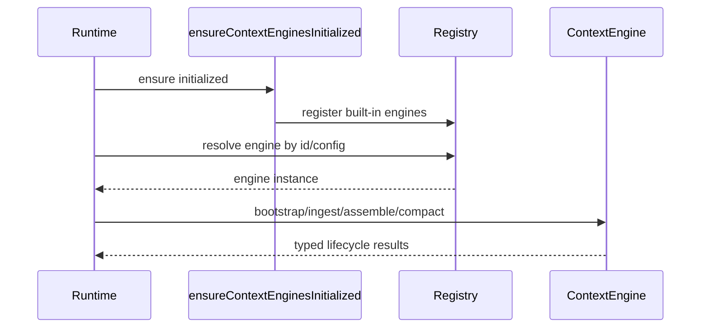

# Context engine architecture

Last updated: 2026-03-09

## Overview

`src/context-engine/` defines OpenClaw’s pluggable context-management abstraction. It separates **runtime orchestration** from **engine-specific strategies** (for assembly, ingest, and compaction).

The module is intentionally small and contract-driven, so new engines can be added without coupling to CLI, gateway, or channel code.

## Core responsibilities

A context engine is responsible for:

- ingesting turns into canonical context storage
- assembling model-ready message windows under token budgets
- compacting historical context when size thresholds are reached
- optionally coordinating subagent-related context lifecycle

## Module map

- `src/context-engine/types.ts`
  - Defines `ContextEngine` interface and lifecycle result types (`AssembleResult`, `CompactResult`, `IngestResult`, etc.).
- `src/context-engine/registry.ts`
  - Global registry for engine factories, plus config-driven engine resolution.
- `src/context-engine/init.ts`
  - One-time initialization hook to register built-in engines.
- `src/context-engine/legacy.ts`
  - Legacy engine adapter/implementation for compatibility paths.
- `src/context-engine/index.ts`
  - Public exports for contracts, registry operations, and initialization entrypoints.

## Engine contract design

The `ContextEngine` contract has a clear lifecycle split:

1. **Bootstrap** (optional): initialize engine/session state.
2. **Ingest**: accept message writes.
3. **Assemble**: produce ordered model context under a budget.
4. **Compact**: reduce context size while preserving continuity.
5. **After-turn hooks** (optional): post-run maintenance.
6. **Subagent hooks** (optional): prepare/cleanup child-run context state.

This separation allows implementers to keep write-path, read-path, and maintenance concerns independent.

## Registry architecture

Registry is a singleton-style module state keyed by `Symbol.for(...)`, so engines remain globally discoverable across modules but still replaceable in tests.

Design patterns used:

- **factory registration** (`ContextEngineFactory`) instead of direct instances
- **ID-based resolution** from runtime config
- **late construction** to avoid heavy initialization during process bootstrap

## Runtime integration flow

## How to design your own engine

When implementing a new engine, follow these design constraints:

- keep `assemble(...)` deterministic for identical inputs
- make `compact(...)` idempotent and explain outcomes via `CompactResult.reason/details`
- treat `afterTurn(...)` as best-effort maintenance (never block core response path indefinitely)
- if you support subagents, provide rollback-safe spawn preparation handles

## Practical extension checklist

- add engine implementation file with full `ContextEngine` interface support
- register factory in initialization path
- ensure engine ID is discoverable via registry helpers
- add focused tests for ingest/assemble/compact behavior and failure handling
- verify behavior under token budget edge cases and empty-session cases

## Related docs

- [Agents system design](/concepts/agents-architecture)
- [Session model](/concepts/session)
- [Memory concept](/concepts/memory)
