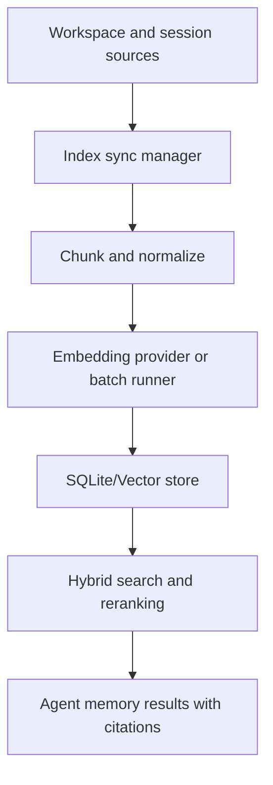

# Memory engine architecture

Last updated: 2026-03-09

## Overview

`src/memory/` implements retrieval memory for OpenClaw agent workflows. It combines:

- local file/session indexing
- embedding generation via multiple providers
- hybrid retrieval and ranking
- runtime manager fallback and sync lifecycle

The subsystem is designed to stay available even when preferred backends fail.

## Design goals

- provide low-latency semantic retrieval for agent reasoning
- support provider-agnostic embeddings (OpenAI/Gemini/Mistral/Ollama/Voyage/remote)
- degrade gracefully when one backend fails
- keep index state repairable and operationally observable

## Module map

### Public entry and contracts

- `src/memory/index.ts`: exports the main manager (`MemoryIndexManager`) and search manager accessors.
- `src/memory/types.ts`: shared runtime contracts (`MemorySearchManager`, `MemorySearchResult`, status/probe types).

### Core orchestration

- `src/memory/manager.ts`: main index manager orchestration (sync, indexing lifecycle, search backend wiring).
- `src/memory/search-manager.ts`: search manager creation, primary/fallback behavior, status forwarding.
- `src/memory/manager-runtime.ts`, `src/memory/manager-sync-ops.ts`, `src/memory/manager-search.ts`, `src/memory/manager-embedding-ops.ts`: internal decomposition for runtime concerns.

### Retrieval and ranking

- `src/memory/hybrid.ts`, `src/memory/mmr.ts`, `src/memory/temporal-decay.ts`: hybrid scoring, diversity re-ranking, and recency signals.
- `src/memory/query-expansion.ts`, `src/memory/qmd-query-parser.ts`: query normalization/expansion logic.

### Storage and backends

- `src/memory/sqlite.ts`, `src/memory/sqlite-vec.ts`: local DB and vector support surfaces.
- `src/memory/qmd-*`: qmd-related manager/process/scope paths.
- `src/memory/session-files.ts`: session transcript ingestion sources.

### Embedding providers and batching

- `src/memory/embeddings.ts`: provider selection entry.
- `src/memory/embeddings-*.ts`: provider-specific clients/adapters.
- `src/memory/batch-*.ts`, `src/memory/batch-runner.ts`, `src/memory/batch-status.ts`: async batch embedding workflows and status.

## Search manager resilience pattern

Memory search uses a primary backend with fallback behavior. If primary search fails, the manager:

1. marks primary as failed,
2. records last error,
3. attempts fallback manager creation,
4. continues serving queries using fallback when available.

This pattern keeps retrieval usable during backend incidents and surfaces fallback state through `status()` metadata.

## End to end pipeline

## Key technologies

- **SQLite + optional vector extensions** for local retrieval state
- **Provider adapters** for embedding portability
- **Batch execution pipeline** for throughput and rate-limit friendliness
- **Hybrid scoring + MMR + temporal decay** for relevance and diversity balance
- **Health probes and status objects** for runtime observability

## Design blueprint for a similar system

If you want to design a similar memory subsystem, split architecture into:

1. **Ingestion plane**: watch/read sources, chunking, metadata extraction.
2. **Embedding plane**: provider abstraction + retries + batching.
3. **Storage plane**: local index schema + vector/index maintenance.
4. **Retrieval plane**: lexical + vector + rerank policy.
5. **Operations plane**: sync scheduling, status, fallback, close/cleanup.

### Minimum reliability baseline

- fallback search backend for primary failures
- bounded retries and timeout budgets on remote embedding calls
- explicit status reporting (backend/provider/vector/fallback/error)
- safe close/cleanup hooks for long-running processes

## Related docs

- [Memory concept](/concepts/memory)
- [Agents system design](/concepts/agents-architecture)
- [Context engine architecture](/concepts/context-engine-architecture)
