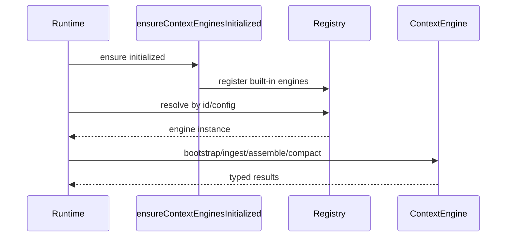

# Context Engine 架构

最后更新：2026-03-09

## 概览

`src/context-engine/` 提供 OpenClaw 的可插拔上下文管理抽象，将**运行时编排**与**引擎策略实现**（assemble/ingest/compact）解耦。

## 核心职责

- 接收会话消息并写入规范化上下文存储
- 在 token 预算内组装模型可用上下文
- 在阈值触发时进行上下文压缩
- （可选）管理子智能体相关上下文生命周期

## 模块地图

- `src/context-engine/types.ts`：`ContextEngine` 接口与结果类型。
- `src/context-engine/registry.ts`：引擎工厂注册与按配置解析。
- `src/context-engine/init.ts`：内置引擎的一次性注册入口。
- `src/context-engine/legacy.ts`：兼容路径的 legacy 实现。
- `src/context-engine/index.ts`：公开导出。

## 契约生命周期

1. `bootstrap`（可选）
2. `ingest` / `ingestBatch`
3. `assemble`
4. `compact`
5. `afterTurn`（可选）
6. 子智能体钩子（可选）

这种拆分能让写入路径、读取路径与维护任务彼此独立。

## 注册中心设计

注册中心基于 `Symbol.for(...)` 的模块级单例状态，具备：

- 工厂注册（而不是直接实例）
- 按 ID 配置解析
- 延迟构建（避免进程启动阶段过重初始化）

## 集成流程

## 自定义引擎建议

- `assemble(...)` 保持输入相同则输出稳定。
- `compact(...)` 尽量幂等，并通过 `reason/details` 解释结果。
- `afterTurn(...)` 作为尽力而为任务，不应长期阻塞主响应路径。
- 支持子智能体时，提供可回滚的 spawn 准备句柄。

## 相关文档

- [智能体系统设计](/concepts/agents-architecture)
- [会话模型](/concepts/session)
- [Memory 概念](/concepts/memory)
