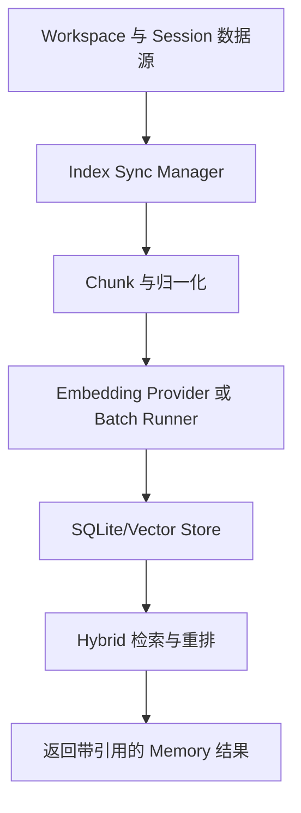

# Memory Engine 架构

最后更新：2026-03-09

## 概览

`src/memory/` 为 OpenClaw 智能体提供检索型记忆能力，组合了：

- 本地文件与会话索引
- 多 provider embedding 生成
- 混合检索与重排
- 搜索管理器回退与同步生命周期

其核心目标是在首选后端异常时仍保持可用。

## 模块地图

### 公共入口与契约

- `src/memory/index.ts`：导出 `MemoryIndexManager` 与 search manager 访问入口。
- `src/memory/types.ts`：`MemorySearchManager`、`MemorySearchResult`、状态/探针类型。

### 核心编排

- `src/memory/manager.ts`：索引同步、后端接线、运行时编排。
- `src/memory/search-manager.ts`：主后端/回退后端切换与状态转发。
- `src/memory/manager-*.ts`：sync/search/embedding/runtime 拆分实现。

### 检索与排序

- `src/memory/hybrid.ts`、`src/memory/mmr.ts`、`src/memory/temporal-decay.ts`。
- `src/memory/query-expansion.ts`、`src/memory/qmd-query-parser.ts`。

### 存储与后端

- `src/memory/sqlite.ts`、`src/memory/sqlite-vec.ts`。
- `src/memory/qmd-*`。
- `src/memory/session-files.ts`。

### Embedding 与批处理

- `src/memory/embeddings.ts` 与 `src/memory/embeddings-*.ts`。
- `src/memory/batch-*.ts`、`src/memory/batch-runner.ts`、`src/memory/batch-status.ts`。

## 搜索降级模式

`search-manager` 使用“主后端 + 回退后端”策略：

1. 主后端失败后标记 `primaryFailed`
2. 记录错误原因
3. 尝试构建回退管理器
4. 在可用时继续服务查询

同时通过 `status()` 暴露 fallback 状态与原因，便于排障与观测。

## 端到端流水线

## 关键技术

- SQLite + 可选向量扩展
- Provider 适配层
- 批处理管线（吞吐与限流友好）
- Hybrid + MMR + 时间衰减
- 健康探针与状态对象

## 设计同类系统建议

建议分成 5 个平面：

1. Ingestion：源读取、分块、元数据提取
2. Embedding：provider 抽象、重试、批处理
3. Storage：本地索引 schema 与向量维护
4. Retrieval：词法 + 向量 + 重排
5. Operations：同步调度、状态、回退、关闭清理

最小可靠性基线：

- 主后端故障可回退
- 远程 embedding 的有界重试与超时
- 显式状态输出（backend/provider/vector/fallback/error）
- 长生命周期进程可安全 close/cleanup

## 相关文档

- [Memory 概念](/concepts/memory)
- [智能体系统设计](/concepts/agents-architecture)
- [Context Engine 架构](/concepts/context-engine-architecture)
